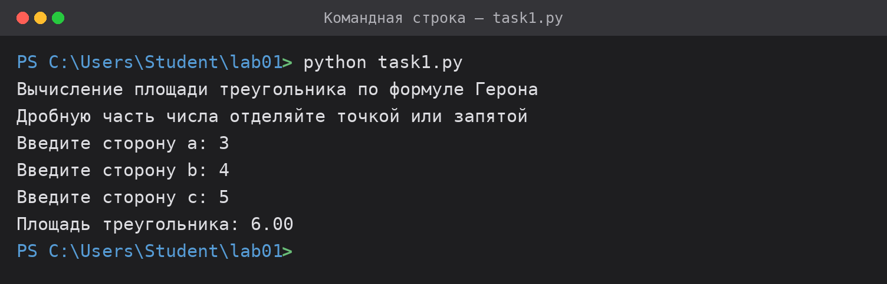
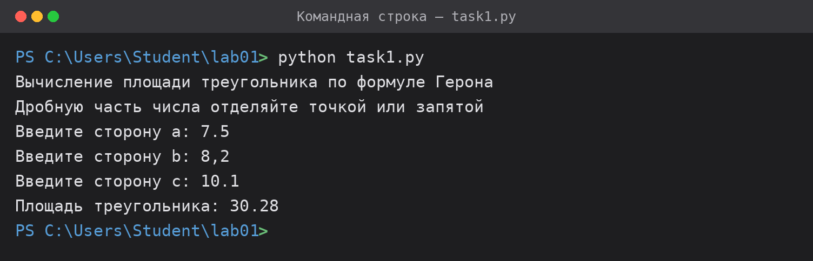
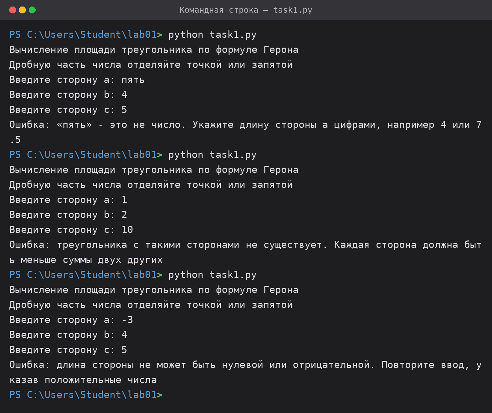
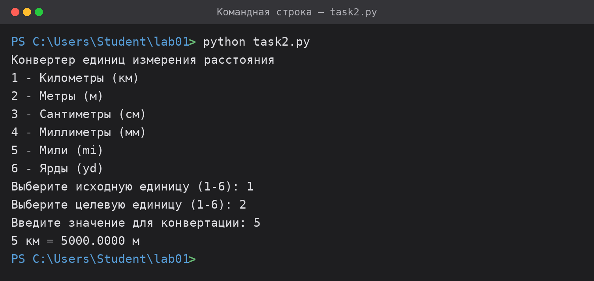
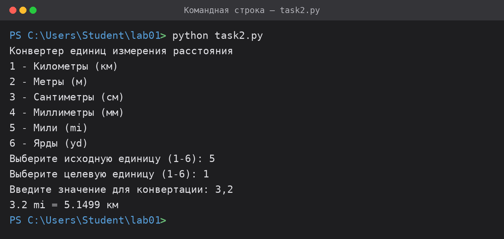
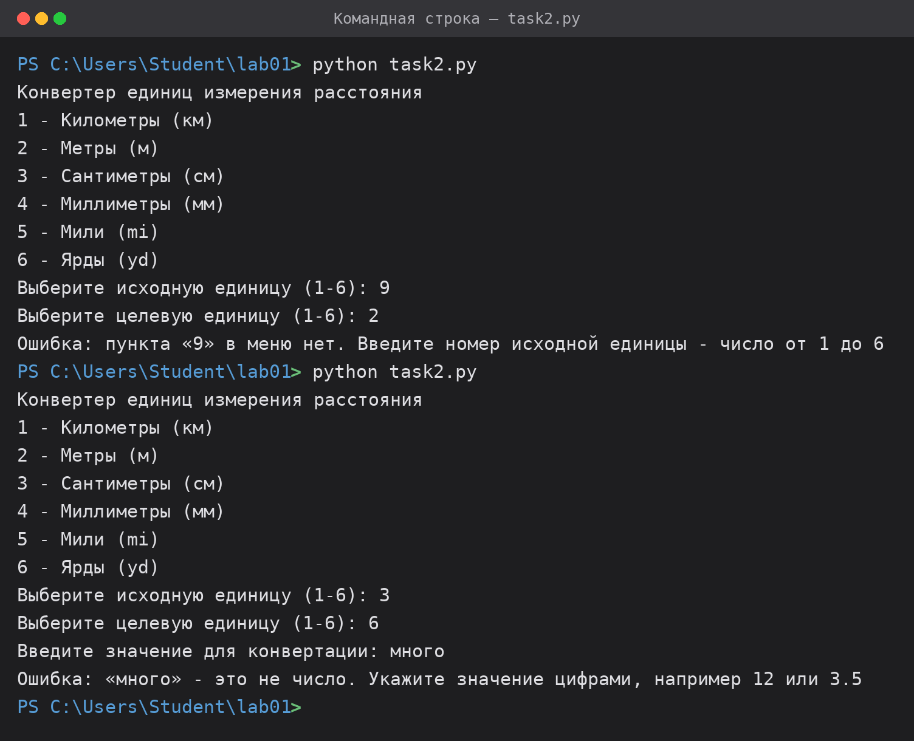
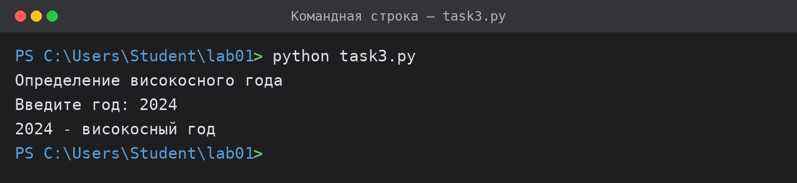
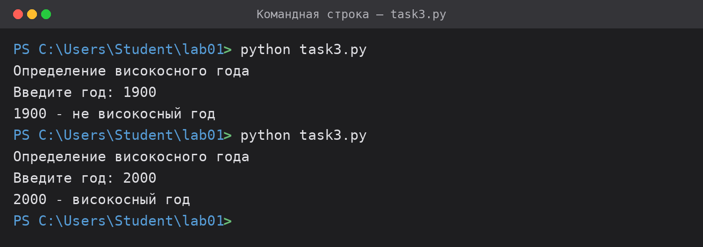
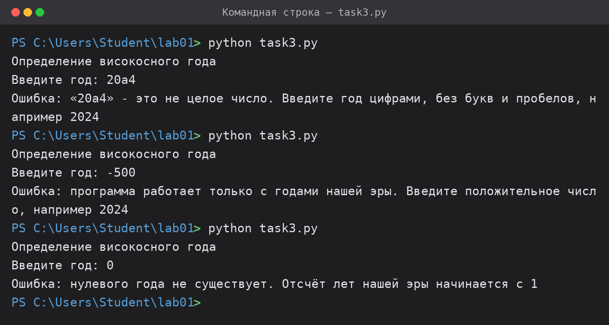

# Лабораторная работа №01 — Операторы ввода/вывода. Условный оператор

## Исполнитель

Сурков Владимир Андреевич  
Группа Фт-150008

## Среда разработки

Язык программирования: Python 3.12.  
Среда разработки: Visual Studio Code (подойдёт любой редактор — PyCharm, IDLE, Visual Studio).  
Дополнительные библиотеки не требуются, используется только стандартная поставка Python.

Каждое задание оформлено отдельной папкой-проектом:

| Задание | Папка | Файл, который нужно открыть |
| --- | --- | --- |
| 1.1 Калькулятор площади треугольника | `task1-triangle-area` | `task1.py` |
| 1.2 Конвертер единиц измерения расстояния | `task2-unit-converter` | `task2.py` |
| 1.3 Определение високосного года | `task3-leap-year` | `task3.py` |

## Как запустить

Клонировать репозиторий и запустить нужный файл из командной строки:

```bash
git clone <ссылка на репозиторий>
cd lab01/task1-triangle-area
python task1.py
```

В Visual Studio Code достаточно открыть папку задания, открыть файл `.py` и нажать **Run → Run Without Debugging** (`Ctrl+F5`).

Во всех трёх программах данные вводятся с клавиатуры по запросу, результат выводится в консоль. При некорректном вводе программа не завершается с ошибкой, а сообщает, что именно введено неверно, и поясняет, как ввести значение правильно.

---

## Задание 1.1 — Калькулятор площади треугольника

### Формулировка

Написать программу, которая вычисляет площадь треугольника по трём его сторонам (по формуле Герона) с точностью до сотых.

Требования к программе:

- пользователь вводит три числа;
- числа могут быть как целыми, так и дробными;
- результат должен быть выведен с двумя знаками после запятой.

### Инструкция по работе

Программа последовательно запрашивает длины сторон `a`, `b` и `c`. Дробную часть можно отделять как точкой, так и запятой (`8.2` и `8,2` равнозначны). После ввода выводится площадь с двумя знаками после запятой.

Программа сообщит об ошибке, если введено не число, если сторона нулевая или отрицательная, а также если треугольника с такими сторонами не существует.

### Результаты тестирования

Тест 1 — стороны заданы целыми числами



Тест 2 — стороны заданы дробными числами



Тест 3 — обработка некорректных данных



---

## Задание 1.2 — Конвертер единиц измерения расстояния

### Формулировка

Создать программу-конвертер, которая переводит расстояние из одних единиц измерения в другие. Программа должна поддерживать следующие единицы: километры (км), метры (м), сантиметры (см), миллиметры (мм), мили (mi), ярды (yd).

Требования к программе:

- пользователь выбирает исходную единицу измерения;
- пользователь выбирает целевую единицу измерения;
- программа запрашивает значение для конвертации;
- выводится результат.

### Инструкция по работе

Программа выводит меню из шести единиц измерения. Нужно ввести номер исходной единицы (от 1 до 6), затем номер целевой единицы и само значение. Результат выводится с четырьмя знаками после запятой.

Перевод выполняется через метры: для каждой единицы задан коэффициент пересчёта в метры. Программа сообщит об ошибке, если выбран несуществующий пункт меню, введено не число или отрицательное расстояние.

### Результаты тестирования

Тест 1 — перевод километров в метры



Тест 2 — перевод миль в километры



Тест 3 — обработка некорректных данных



---

## Задание 1.3 — Определение високосного года

### Формулировка

Написать программу, которая определяет, является ли введённый год високосным.

Правила определения високосного года:

- год делится на 4;
- но если год делится на 100, он не является високосным;
- однако если год делится на 400, он всё равно считается високосным.

Требования к программе:

- программа должна запрашивать у пользователя ввод года;
- необходимо использовать условные операторы;
- должен выводиться результат.

### Инструкция по работе

Программа запрашивает год и выводит, является ли он високосным. Правила проверяются каскадом `if-elif-else` в порядке убывания приоритета: сначала делимость на 400, затем на 100 и только потом на 4 — такой порядок даёт верный результат для «спорных» годов вроде 1900 и 2000.

Программа сообщит об ошибке, если введено не целое число, отрицательное значение или ноль.

### Результаты тестирования

Тест 1 — високосный год (2024)



Тест 2 — годы, кратные 100 и 400 (1900 и 2000)



Тест 3 — обработка некорректных данных


